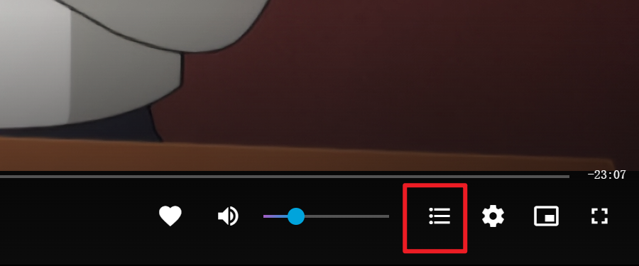

# Jellyfin-InPlayerEpisodePreview

Jellyfin 播放器选集功能扩展脚本

## 项目简介

本项目为 Jellyfin 播放器提供选集功能扩展，允许用户在播放器 OSD（屏幕显示菜单）中直接切换剧集，无需退出播放器界面。

## 功能截图




## 功能特点

- **播放器内选集**：在播放器 OSD 界面中添加选集按钮，支持快速切换剧集
- **智能显示**：仅在播放剧集类型内容时显示选集功能
- **无依赖安装**：纯前端脚本，无需修改 Jellyfin 后端代码
- **实时同步**：自动获取当前播放项目信息，确保选集列表准确

## 安装方法

### 方法一：用户脚本管理器

1. 安装用户脚本管理器，如 [Tampermonkey](https://www.tampermonkey.net/) 或 [Violentmonkey](https://violentmonkey.github.io/)
2. 点击 [此处](https://greasyfork.org/zh-CN/scripts/545514-jellyfin-%E6%92%AD%E6%94%BE%E5%99%A8%E9%80%89%E9%9B%86%E5%8A%9F%E8%83%BD) 在 Greasyfork 安装脚本，或手动创建新脚本，将 `InPlayerEpisodePreview.js` 中的代码复制粘贴进去
3. 保存并启用脚本
4. 刷新 Jellyfin 网页界面即可使用

### 方法二：Nginx 反向代理部署

1. 将 `InPlayerEpisodePreview.js` 文件上传到 Nginx 服务器的 `/usr/share/nginx/html/js/` 目录
2. 参考项目中的 `jellyfin.conf` 配置文件，修改您的 Nginx 配置
3. 重启 Nginx 服务：

```bash
sudo systemctl restart nginx
```

4. 访问 Jellyfin 网页界面，脚本将自动加载


## 使用说明

安装成功后，在播放剧集内容时：

1. 播放器 OSD 控制栏中会出现选集按钮（列表图标）
2. 点击选集按钮弹出剧集列表
3. 选择想要观看的剧集，播放器将自动切换并开始播放
4. 脚本会自动检测内容类型，仅在剧集内容下显示选集功能

## 支持与反馈

如果您在使用过程中遇到问题或有功能建议，请在 [GitHub Issues](https://github.com/guiyuanyuanbao/Jellyfin-InPlayerEpisodePreview/issues) 中提交。

## 许可证

本项目基于 MIT 许可证开源，详情请参阅 [LICENSE](LICENSE) 文件。
